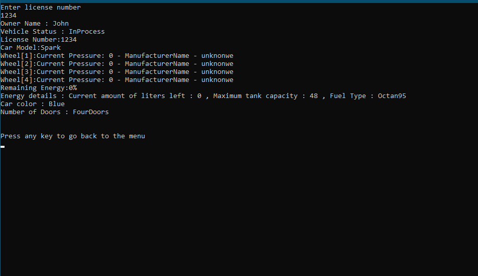
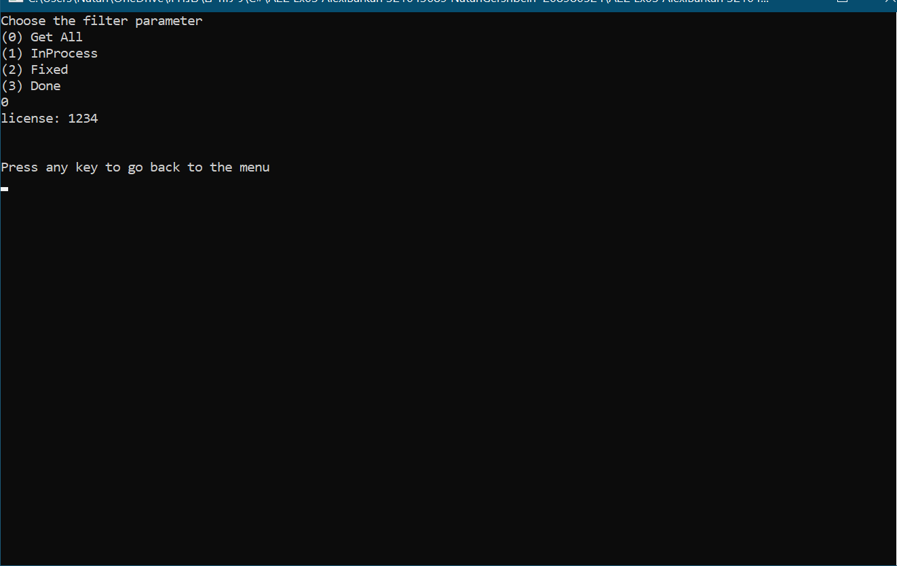
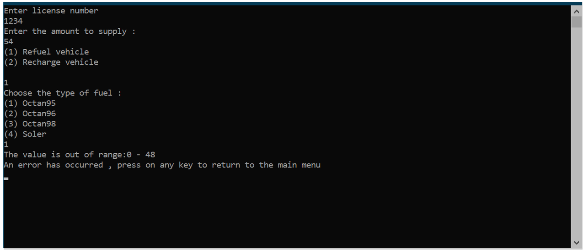

# EX03-GarageSystem
Assignment in DotNet course which demonstrated OOP Concept

##  Summary

### The project divide into 2 parts:

 1. Garage Logic
 2. Console UI

This project is a complicated Garage management system that demonstrates the important OOP development concept such as:

1. Polymorphism
2. Inheritance

further more the project includes:
- Complicated hierarchy of class
- Collection usage
- Exceptions
- Enums 
## Project functionality
This system knows  manage garage that contains 5 type of vehicles
1.Regular Motorcycle 
2. Electric Motorcycle 
3. Regular  Car
4. Electric Car
5. Truck
Each vehicle has common attributes and unique attributes.

System Actions:
- Insert new vehicle to garage
- Display list of current vehicles id  sorted by vehicle status
- Change vehicle treatment status
- Inflate wheels
- Charge or refuel vehicle
- Display data  for vehicle by his id  including unique data according to vehicle type
# 

